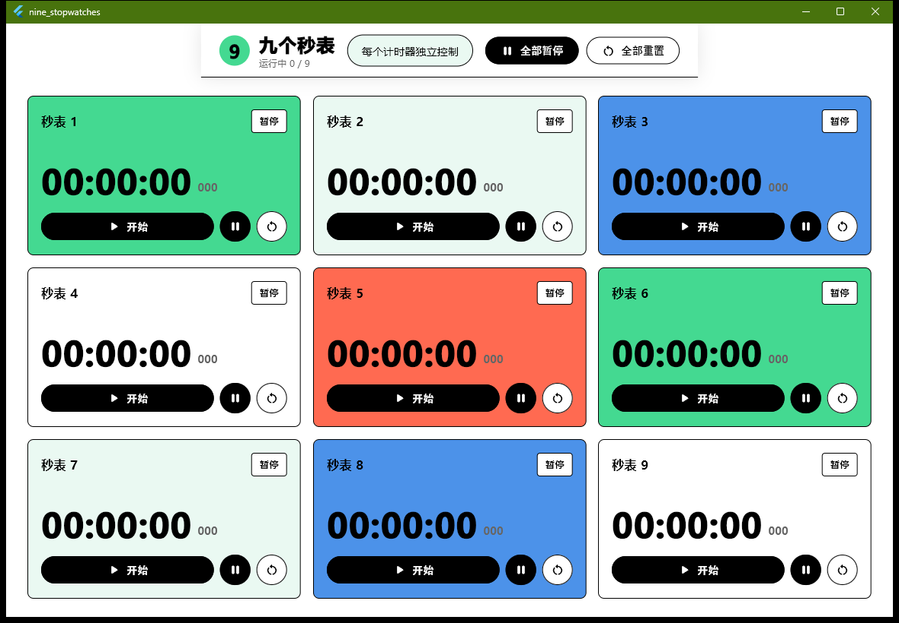

# 九个秒表

九个秒表是一个 Windows 桌面计时工具，基于原始 PyQt 原型用 Flutter + Rust 重新实现。应用启动后直接显示 3 x 3 的九个独立秒表，每个秒表都可以单独开始、暂停、重置，也支持一键全部暂停和一键全部重置。



## 功能特点

- 9 个独立秒表，按 10 ms 间隔刷新。
- 每个秒表支持开始、暂停、重置。
- 顶部提供全部暂停、全部重置。
- 桌面窗口会根据可用分辨率调整卡片高度、间距和字体，启动后优先让全部 9 个秒表显示在首屏。
- Rust 原生核心负责时间累加和 `HH:MM:SS.mmm` 格式化。
- 提供单文件 Windows 启动器，便于发布和分发。

## 项目结构

```text
lib/                         Flutter GUI、状态管理和 Dart FFI 桥接
rust/stopwatch_core/         Rust 秒表核心，静态链接到 Windows runner
rust/portable_launcher/      Rust 单文件启动器，嵌入 Flutter release bundle
windows/                     Flutter Windows runner 与 CMake 集成
test/                        Flutter widget 测试
docs/                        README 截图等公开文档资源
.github/workflows/           GitHub Actions 发布构建流程
scripts/                     本地构建脚本
```

## 环境要求

- Flutter stable，并启用 Windows desktop 支持。
- Rust stable toolchain。
- Visual Studio Build Tools，包含 MSVC 和 Windows SDK。

建议将 `flutter` 和 `cargo` 加入 PATH。本地打包脚本也支持通过 `FLUTTER_BIN` 环境变量指定 `flutter` 可执行文件路径。

## 本地开发

```powershell
flutter pub get
flutter analyze
flutter test
cargo test --manifest-path rust/stopwatch_core/Cargo.toml
flutter build windows --release
```

## 本地构建单文件 EXE

推荐直接运行脚本：

```powershell
.\scripts\build_portable.ps1
```

脚本会执行以下流程：

1. 构建 Flutter Windows release。
2. 将 `build/windows/x64/runner/Release/` 压缩为 bundle zip。
3. 编译 Rust portable launcher。
4. 在项目根目录生成 `九个秒表.exe`。

生成的 `九个秒表.exe` 是本地构建产物，已被 `.gitignore` 排除，不会上传到 GitHub。

## GitHub Release

`.github/workflows/release.yml` 已配置 Windows release 构建流程：

- 拉取 Flutter 和 Rust 环境。
- 执行 `flutter analyze`、`flutter test` 和 Rust core 测试。
- 构建 Flutter Windows release。
- 生成嵌入式 bundle。
- 编译单文件启动器。
- 上传 `NineStopwatches-Windows-x64.exe` 作为 artifact。
- 当推送 `v*` 标签时，自动创建 GitHub Release 并上传 exe。

当前仓库只做了本地 git 初始化和提交，尚未推送到 GitHub。

## 许可证

本项目使用 MIT License，详见 [LICENSE](LICENSE)。
